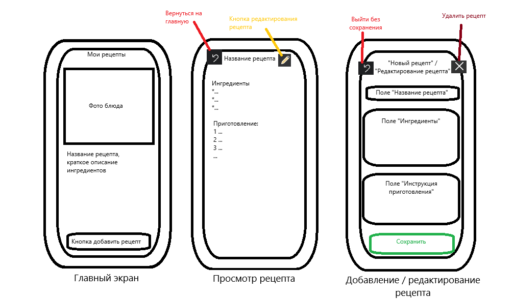

1. Название проекта и краткое описание.

Название: "Кулинарная Книга"

Краткое описание: Это мобильное приложение для хранения и быстрого доступа к кулинарным рецептам. Пользователь может создавать, просматривать, искать и редактировать рецепты, всегда имея под рукой свою персональную поваренную книгу.

2. Основные функции.

	1) Просмотр списка рецептов: Отображение всех рецептов в виде списка или сетки карточек.
	2) Поиск по рецептам: Фильтрация списка рецептов по названию в реальном времени.
	3) Просмотр деталей рецепта: Отображение полной информации о выбранном рецепте: название, список ингредиентов 	   и пошаговая инструкция приготовления.
	4) Добавление нового рецепта: Возможность внести все данные рецепта через форму ввода.
	5) Редактирование существующего рецепта: Изменение данных любого рецепта.
	6) Удаление рецепта: Удаление рецепта из коллекции.
3. Структура экранов:

4. Навигация:
Старт приложения - Открывается "Главный экран".
"Главный экран" - "Просмотр рецепта": Пользователь нажимает на карточку рецепта в списке.

"Главный экран" - "Добавление рецепта": Пользователь нажимает кнопку "Добавить рецепт".

"Просмотр рецепта" - "Редактирование рецепта": Пользователь нажимает кнопку "Изменить" (карандаш).

"Добавление/Редактирование рецепта" - "Главный экран":
	При нажатии "Сохранить возвращает пользователя на главный экран, где обновленный список рецептов уже отображает 		изменения.
	При нажатии "Отмена" (если пришли с главного экрана) — возврат на главный экран.
	
"Просмотр рецепта" - "Главный экран": Стандартный возврат по кнопке "Назад".

"Редактирование рецепта" - "Просмотр рецепта": при нажатии "Отмена" (если пришли из просмотра) — возврат на экран просмотра этого рецепта.
